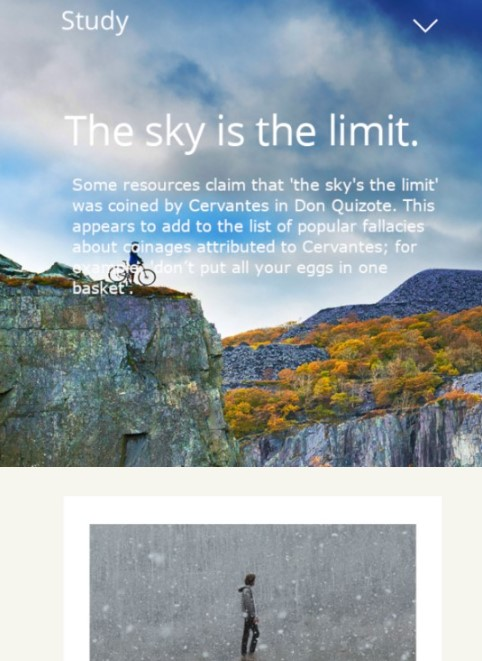
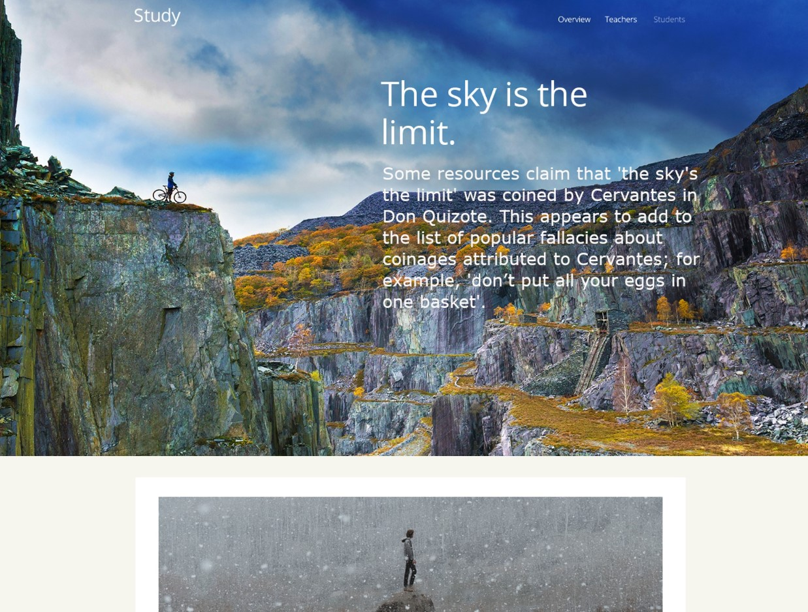

# Singapore-Website 

* A sample layout of project work in different screen size

#### Mobile ####

 #### Tablet/Desktop ####

### Github Repository
- Refer to github over [here](https://github.com/xunne899/front-end-assignment) for more details.

# Summary
A singapore front end website assignment. Technologies like HTML, CSS & Javascript were used. Using GIMP to change some text, font, layout design according to client request for Singapore webpage. Also GIMP was used to slice PSD files into various images & incorporated into singapore website. The web will be responsive according to desktop, tablet, mobile screensize. Javascript function was used to enable smooth transition from desktop to tablet & mobile view without refreshing.
mediaQuery.addEventListener was used to ensure that the function is called when the screen size changes, which is supported by Firefox and other browsers.
Tags - eg. header, body, main, section, footer were used

- Mobile (max-width:320px)
- Tablet (min-width:321px) and (max-width:768px)
- Desktop (min-width:769px)

## Technology Used 
- GIMP - slicing, making changes to content requested by clients
- HTML - layout content of the desktop webpage
- CSS - font design layout of the webpage
- Javascript - to make the website responsive to different screensize (desktop, tablet, mobile)
